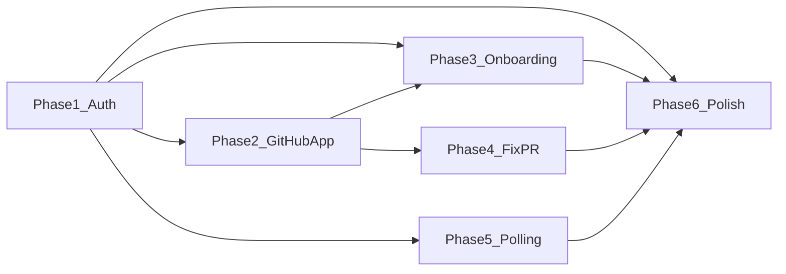
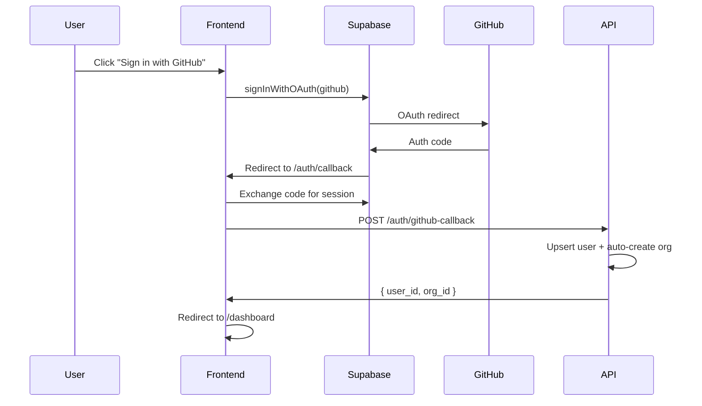
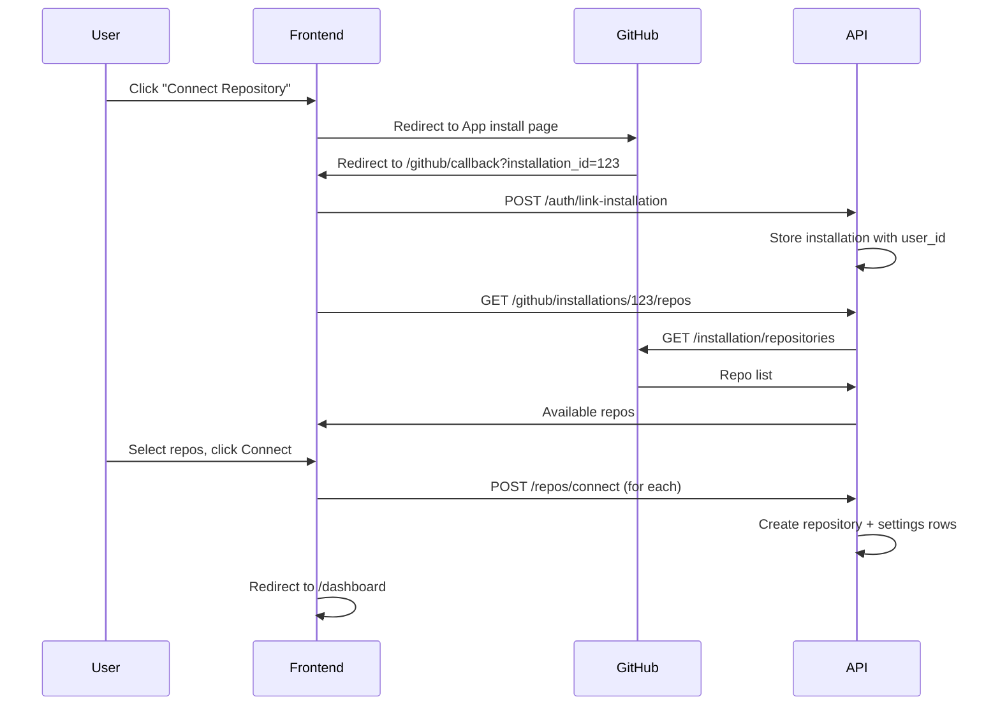

# Coreloop — Full-Stack Wiring Implementation Plan

The app has a backend with 15+ endpoints and a frontend with 5 pages, but they are not connected through any real user flow. This plan closes every gap in [GAPS.md](GAPS.md) across 6 phases.



Phases 1 and 2 are sequential (auth must exist before GitHub flow). Phases 3, 4, and 5 can run in parallel after Phase 2. Phase 6 is the final sweep after everything works.

---

## Phase 1 — Authentication (Supabase Auth + GitHub OAuth)

**Goal:** A user can sign in with GitHub and all API calls are authenticated.



### Database

New migration `infra/supabase/migrations/20260218000000_auth_and_installations.sql`:

- Alter `users` table: add `github_id bigint`, `github_login text`, `avatar_url text`
- New `github_installations` table:

```sql
create table github_installations (
    id               uuid primary key default gen_random_uuid(),
    installation_id  bigint unique not null,
    account_login    text not null,
    account_id       bigint not null,
    user_id          uuid references users(id) on delete set null,
    created_at       timestamptz not null default now()
);
```

- Add `installation_id bigint` column to `repositories` (FK to `github_installations.installation_id`)
- Index on `github_installations.user_id`

### Backend changes

**`app/auth/dependencies.py`** — Replace stub with real JWT validation:

```python
from fastapi import Header, HTTPException, status
from jose import JWTError, jwt
from app.core.config import get_settings

async def get_current_user(
    authorization: str = Header(...),
    db: AsyncSession = Depends(get_db),
) -> uuid.UUID:
    token = authorization.removeprefix("Bearer ").strip()
    settings = get_settings()
    payload = jwt.decode(
        token,
        settings.supabase_jwt_secret,
        algorithms=["HS256"],
        audience="authenticated",
    )
    sub = payload.get("sub")  # Supabase user UUID
    # Upsert user row (first login creates the user)
    ...
    return uuid.UUID(sub)
```

- Add `SUPABASE_JWT_SECRET` to `app/core/config.py` (found in Supabase Dashboard -> Settings -> API -> JWT Secret)
- Add `python-jose[cryptography]` to `apps/api/pyproject.toml`
- Add auth dependency to settings router (`GET/PUT /repos/{repo_id}/settings`)

**New endpoint** `POST /auth/github-callback`:

- Receives `{ github_id, github_login, avatar_url, email }` from frontend after Supabase OAuth completes
- Upserts `users` row with GitHub metadata
- Auto-creates a default `organizations` row if none exists (name = github_login)
- Returns `{ user_id, org_id }`

### Frontend changes

**New dependency:** `@supabase/supabase-js` + `@supabase/ssr`

**New file `lib/supabase/client.ts`:**

- Browser Supabase client (uses `NEXT_PUBLIC_SUPABASE_URL` and `NEXT_PUBLIC_SUPABASE_ANON_KEY`)

**New file `lib/supabase/server.ts`:**

- Server-side Supabase client (for RSC data fetching)

**New file `lib/supabase/middleware.ts`:**

- Token refresh logic for Next.js middleware

**New file `app/login/page.tsx`:**

- Full-page login with "Sign in with GitHub" button
- Calls `supabase.auth.signInWithOAuth({ provider: 'github' })`
- Redirects to `/auth/callback` after GitHub OAuth completes

**New file `app/auth/callback/route.ts`:**

- Next.js route handler that exchanges the OAuth code for a session
- Calls `POST /auth/github-callback` to upsert user + org
- Redirects to `/dashboard`

**New file `middleware.ts`** (root of `apps/web/`):

- Checks for Supabase session on every request
- Redirects unauthenticated users to `/login` (except `/`, `/login`, `/auth/callback`)

**Update `lib/api.ts`:**

- `apiFetch()` reads the Supabase session token and attaches `Authorization: Bearer <token>`
- On 401 response, redirect to `/login`

**Update `components/nav.tsx`:**

- Add user avatar + logout button
- Logout calls `supabase.auth.signOut()` then redirects to `/`

**Env vars to add:**

- `NEXT_PUBLIC_SUPABASE_URL` (same as existing `SUPABASE_URL`)
- `NEXT_PUBLIC_SUPABASE_ANON_KEY` (same as existing `SUPABASE_ANON_KEY`)
- `SUPABASE_JWT_SECRET` (backend only)

**Supabase dashboard config:**

- Enable GitHub OAuth provider in Supabase Auth settings
- Set GitHub OAuth client ID + secret (from GitHub App or a separate OAuth app)
- Set Site URL and redirect URLs

### Tests (~28 tests)

**Backend — `tests/auth/test_dependencies.py`** (rewrite, replaces stub tests):

- `test_valid_jwt_returns_user_uuid` — craft a HS256 JWT with `sub` claim, verify `get_current_user` returns matching UUID
- `test_expired_jwt_raises_401` — JWT with `exp` in the past
- `test_missing_authorization_header_raises_401` — no header at all
- `test_malformed_token_raises_401` — garbage string, no "Bearer" prefix, empty string
- `test_wrong_audience_raises_401` — JWT with audience != "authenticated"
- `test_first_login_upserts_user` — call `get_current_user` with a UUID that has no `users` row yet, verify row is created

**Backend — `tests/auth/test_callback.py`** (new file):

- `test_github_callback_creates_user_and_org` — first-time login creates both `users` row (with `github_id`, `github_login`, `avatar_url`) and a default `organizations` row
- `test_github_callback_idempotent` — calling twice with the same `github_id` does not duplicate user/org
- `test_github_callback_updates_github_metadata` — if user changes their avatar/login, it updates
- `test_github_callback_missing_fields_returns_422` — missing required fields in body
- `test_github_callback_returns_org_id` — response body includes `org_id`

**Backend — `tests/settings/test_router.py`** (update existing):

- `test_get_settings_without_auth_returns_401` — no Authorization header
- `test_put_settings_without_auth_returns_401` — no Authorization header
- `test_get_settings_with_auth_succeeds` — valid JWT returns settings
- `test_put_settings_wrong_user_returns_404` — JWT for user who doesn't own the repo

**Backend — `tests/conftest.py`** (update):

- Add a `jwt_token` fixture that mints a valid test JWT matching `STUB_USER_ID`
- Update `seeded_client` to send `Authorization: Bearer {jwt_token}` on every request
- Add a `unauthed_client` fixture for testing 401 paths

**Frontend — `tests/pages/login.test.tsx`** (new file):

- `test_renders_sign_in_with_github_button` — button text and presence
- `test_renders_app_branding` — page shows "Coreloop"
- `test_no_authenticated_content_visible` — no nav, no dashboard links

**Frontend — `tests/lib/api.test.ts`** (new file):

- `test_apiFetch_attaches_bearer_token` — mock `supabase.auth.getSession()`, verify fetch is called with `Authorization` header
- `test_apiFetch_redirects_on_401` — mock a 401 response, verify redirect to `/login`
- `test_apiFetch_works_without_session_for_public_endpoints` — when session is null, still makes the call (for health endpoints)

**Frontend — `tests/components/nav.test.tsx`** (new file):

- `test_renders_user_avatar_when_logged_in` — mock session with avatar_url
- `test_renders_logout_button_when_logged_in`
- `test_logout_calls_signOut`
- `test_renders_login_link_when_not_authenticated`

---

## Phase 2 — GitHub App Installation + Repo Connection Flow

**Goal:** A user can install the Coreloop GitHub App and connect repos from the UI.



### Backend changes

**ORM model** `GitHubInstallation` in `app/db/models.py` matching the new migration table.

**Update webhook handler** `app/github/router.py`:

- On `installation` event with `action: "created"`: upsert `github_installations` row
- On `installation_repositories` event: upsert installation + log repo list
- On `installation` event with `action: "deleted"`: mark installation as removed

**New endpoints:**

- `GET /github/installations` — list installations for the current user
- `GET /github/installations/{installation_id}/repos` — list repos available via the installation (calls GitHub API: `GET /installation/repositories` with installation token)
- `POST /repos/connect` (update existing) — accept `installation_id` as a new field, persist it on the repository row

### Frontend changes

**New page `app/github/install/page.tsx`:**

- Redirects browser to `https://github.com/apps/YOUR_APP_SLUG/installations/new`
- Passes `state` param with the user's session ID for CSRF protection

**New page `app/github/callback/page.tsx`:**

- GitHub redirects here with `installation_id` query param after App installation
- Calls `POST /auth/link-installation` to associate installation with current user
- Then shows the repo picker

**New component `components/repo-picker.tsx`:**

- Client component
- Fetches `GET /github/installations/{installation_id}/repos`
- Lists repos with checkboxes
- "Connect selected" button calls `POST /repos/connect` for each selected repo
- Shows success state, then redirects to `/dashboard`

**Update `app/dashboard/page.tsx`:**

- Replace "Install the GitHub App to get started" with a "Connect Repository" button
- Button links to `/github/install`

**New `lib/api.ts` functions:**

- `getInstallations(): Promise<Installation[]>`
- `getInstallationRepos(installationId: number): Promise<GitHubRepo[]>`
- `connectRepo(body: ConnectRepoRequest): Promise<Repository>`

### Tests (~25 tests)

**Backend — `tests/github/test_webhook_persistence.py`** (new file):

- `test_installation_created_event_persists_row` — send a valid `installation` webhook with `action: "created"`, verify `github_installations` row exists with correct `installation_id`, `account_login`, `account_id`
- `test_installation_created_event_is_idempotent` — send the same event twice, verify only one row
- `test_installation_deleted_event_removes_row` — send `action: "deleted"`, verify row is removed or flagged
- `test_installation_repositories_event_logs_repos` — send `installation_repositories` event, verify installation is upserted and repo list is parseable
- `test_invalid_signature_rejected` — wrong HMAC, verify 401
- `test_missing_signature_rejected` — no header, verify 401

**Backend — `tests/github/test_installations_router.py`** (new file):

- `test_list_installations_returns_users_installations` — seed an installation for the test user, verify `GET /github/installations` returns it
- `test_list_installations_excludes_other_users` — seed an installation for a different user, verify it's not in the response
- `test_list_installations_empty` — user with no installations gets empty list
- `test_get_installation_repos_calls_github_api` — mock httpx, verify the endpoint calls GitHub API with correct installation token and returns the repo list
- `test_get_installation_repos_unauthorized` — no auth header returns 401

**Backend — `tests/repos/test_connect.py`** (new or update `test_router.py`):

- `test_connect_repo_with_installation_id` — provide `installation_id` in body, verify it's stored on the repository row
- `test_connect_repo_without_installation_id_still_works` — backward compatibility
- `test_connect_repo_invalid_installation_returns_422` — `installation_id` doesn't exist in `github_installations`
- `test_connect_repo_creates_default_settings` — verify settings row with defaults is created alongside the repo

**Frontend — `tests/components/repo-picker.test.tsx`** (new file):

- `test_renders_loading_state` — shows skeleton/spinner while fetching
- `test_renders_repo_list_with_checkboxes` — mock API response with 3 repos, verify all rendered with checkboxes
- `test_connect_button_disabled_when_no_repos_selected` — nothing checked, button disabled
- `test_connect_button_enabled_when_repos_selected` — check 1 repo, button enabled
- `test_connect_calls_api_for_each_selected_repo` — select 2 repos, click connect, verify `connectRepo` called twice
- `test_shows_success_state_after_connection` — after successful connect, shows success message
- `test_shows_error_on_api_failure` — mock API error, verify error message shown

**Frontend — `tests/pages/dashboard.test.tsx`** (update existing):

- `test_shows_connect_repository_button_when_repos_empty` — replace old "Install the GitHub App" assertion
- `test_connect_button_links_to_github_install_page`

---

## Phase 3 — Onboarding + First Run

**Goal:** After connecting a repo, auto-trigger the first baseline run and show meaningful progress.

### Backend changes

**Update `POST /repos/connect`** in `app/repos/router.py`:

- After creating the repository + settings rows, auto-enqueue the first run via `execute_run.delay(str(run.id))`
- Return the created run ID in the response

### Frontend changes

**Update `app/repos/[repoId]/page.tsx`:**

- When the page loads and there's exactly 1 run in `queued` or `running` status, show a first-run onboarding banner:
  - "Coreloop is analyzing your repository for the first time. This usually takes 2-5 minutes."
  - Progress indicator (see Phase 5 for real-time, but use polling here initially)

**Update `app/dashboard/page.tsx`:**

- Newly connected repos should show a "Setting up..." badge on the card
- Add `latest_run_status` to the repo card (requires backend to return it — either a new field on `RepoResponse` or a join)

**Update `RepoResponse` schema** in `app/repos/schemas.py`:

- Add `latest_run_status: Optional[str]` — populated by a subquery or eager-load of the most recent run

### Tests (~13 tests)

**Backend — `tests/repos/test_auto_run.py`** (new file):

- `test_connect_repo_auto_enqueues_run` — after `POST /repos/connect`, verify a `Run` row exists with status `queued` and `execute_run.delay` was called (mock Celery)
- `test_connect_repo_run_has_correct_repo_id` — the auto-created run's `repo_id` matches the new repo
- `test_connect_repo_returns_run_id` — response body includes `initial_run_id`

**Backend — `tests/repos/test_router.py`** (update):

- `test_list_repos_includes_latest_run_status` — seed a repo with a completed run, verify `latest_run_status` is `"completed"` in the list response
- `test_list_repos_latest_run_status_null_when_no_runs` — repo with no runs has `latest_run_status: null`
- `test_get_repo_includes_latest_run_status` — same for single-repo GET

**Frontend — `tests/components/onboarding-banner.test.tsx`** (new file):

- `test_renders_when_single_queued_run` — banner visible with correct copy
- `test_renders_when_single_running_run` — banner visible with progress indicator
- `test_hidden_when_run_completed` — banner not rendered
- `test_hidden_when_multiple_runs` — not a first-run scenario

**Frontend — `tests/pages/dashboard.test.tsx`** (update):

- `test_repo_card_shows_setting_up_badge_when_latest_run_queued` — mock repo with `latest_run_status: "queued"`, verify badge
- `test_repo_card_shows_running_badge_when_latest_run_running`
- `test_repo_card_shows_no_badge_when_latest_run_completed`

---

## Phase 4 — Fix PR Creation

**Goal:** "Create PR" button actually creates a real PR on GitHub.

### Backend changes

**Update `create_pr_for_proposal`** in `app/github/service.py`:

- Replace hardcoded `owner`, `repo_name`, `installation_id` with real values:

```python
async def create_pr_for_proposal(repo: Repository, proposal: Proposal) -> str:
    if not repo.github_full_name:
        raise ValueError("Repository has no github_full_name")

    owner, repo_name = repo.github_full_name.split("/", 1)
    installation_id = repo.installation_id

    if not installation_id:
        raise ValueError("Repository has no GitHub App installation")

    token = await github_client.get_installation_token(installation_id)
    # ... rest stays the same with real values ...
```

**Update `create_pr` endpoint** in `app/github/router.py`:

- Eagerly load `repo.installation_id` (will exist after Phase 2 migration)

### Tests (~11 tests)

**Backend — `tests/github/test_service.py`** (update existing):

- `test_create_pr_parses_github_full_name` — repo with `github_full_name="acme/api"`, verify `owner="acme"`, `repo_name="api"` passed to client
- `test_create_pr_raises_when_no_github_full_name` — `github_full_name` is None, expect `ValueError`
- `test_create_pr_raises_when_no_installation_id` — `installation_id` is None, expect `ValueError`
- `test_create_pr_gets_installation_token` — mock `get_installation_token`, verify called with correct `installation_id`
- `test_create_pr_full_flow_with_mocked_github` — mock all httpx calls (get_installation_token, get_default_branch_sha, create_branch, create_pull_request), verify the full chain produces a `pr_url`
- `test_pr_title_includes_proposal_summary` — verify title format `"[Coreloop] <summary>"`
- `test_pr_body_includes_coreloop_attribution` — verify attribution link in PR body

**Backend — `tests/github/test_router.py`** (new file):

- `test_create_pr_endpoint_with_mocked_service` — mock `create_pr_for_proposal`, verify endpoint returns `pr_url` and stores it on the proposal
- `test_create_pr_duplicate_returns_409` — proposal already has `pr_url`, verify 409 Conflict
- `test_create_pr_wrong_repo_returns_404` — proposal belongs to different repo
- `test_create_pr_without_auth_returns_401`

**Frontend — `tests/components/create-pr-button.test.tsx`** (update existing):

- Verify existing tests still pass (they already test success, error, loading states)
- `test_create_pr_passes_real_repo_id` — verify `createPR` is called with the `repoId` prop, not an empty string

---

## Phase 5 — Real-time Run Status Updates

**Goal:** When a run is queued/running, the UI updates automatically without page refresh.

### Approach: Client-side polling (simpler than Supabase Realtime, sufficient for MVP)

### Frontend changes

**New hook `lib/hooks/use-run-polling.ts`:**

```typescript
export function useRunPolling(repoId: string, initialRuns: Run[]) {
  const [runs, setRuns] = useState(initialRuns);

  useEffect(() => {
    const hasActiveRun = runs.some(r => r.status === "queued" || r.status === "running");
    if (!hasActiveRun) return;

    const interval = setInterval(async () => {
      const updated = await getRuns(repoId);
      setRuns(updated);
      if (!updated.some(r => r.status === "queued" || r.status === "running")) {
        clearInterval(interval);
      }
    }, 5000);

    return () => clearInterval(interval);
  }, [repoId, runs]);

  return runs;
}
```

**Update `app/repos/[repoId]/page.tsx`:**

- Extract the run-list section into a client component `RepoRunList`
- Pass initial server-fetched runs as props
- Use `useRunPolling` to keep runs fresh while any are active

**Update `TriggerRunButton`:**

- After "Queued" state, trigger a page-level re-fetch (via callback or router refresh)

### Tests (~10 tests)

**Frontend — `tests/lib/hooks/use-run-polling.test.ts`** (new file):

- `test_does_not_poll_when_all_runs_completed` — pass runs with status `completed`, verify no interval is set
- `test_does_not_poll_when_all_runs_failed` — same for `failed`
- `test_starts_polling_when_run_is_queued` — pass a `queued` run, advance fake timers by 5s, verify `getRuns` was called
- `test_starts_polling_when_run_is_running` — same for `running`
- `test_stops_polling_when_runs_transition_to_terminal` — initial run is `running`, first poll returns `completed`, verify interval is cleared
- `test_updates_runs_state_from_poll_response` — verify the hook's returned runs array reflects the API response
- `test_cleans_up_interval_on_unmount` — unmount the hook, verify clearInterval was called

**Frontend — `tests/components/repo-run-list.test.tsx`** (new file):

- `test_renders_initial_runs_from_server` — server-fetched runs appear immediately
- `test_shows_trigger_run_button` — button is present in the header
- `test_run_status_updates_after_poll` — mock `getRuns` to return updated status, advance timers, verify UI updates

---

## Phase 6 — Polish, Security, and Test Coverage

### Security

- Add auth dependency to `GET/PUT /repos/{repo_id}/settings` in `app/settings/router.py`
- Add auth dependency to `POST /artifacts/upload` (or verify it's internal-only via network boundary)
- Add CORS origin restriction in `.env` (remove `["*"]`)

### Loading and error states

- Add loading skeletons to dashboard, repo page, and proposal page (use `loading.tsx` convention)
- Add `error.tsx` boundaries for each route segment
- Add `not-found.tsx` for better 404 handling

### Nav improvements

- Add user avatar + GitHub login to nav (from Supabase session)
- Add logout button
- Add mobile hamburger menu

### Command override UI

- Add read-only "Detected commands" section to settings page
- Show `install_cmd`, `build_cmd`, `test_cmd`, `typecheck_cmd` from the repo record
- Add editable override fields (future: `PUT /repos/{repo_id}` endpoint for command overrides)

### Branding cleanup

- Update `mvp.md` and `technical-mvp.md` references from SelfOpt to Coreloop
- Update `.gitignore` temp dir pattern from `selfopt-*` to `coreloop-*`
- Update homepage GitHub link to correct repo URL
- Add favicon / app icon

### Tests (~18 tests)

**Backend — security audit tests `tests/security/test_auth_guards.py`** (new file):

- `test_every_protected_endpoint_requires_auth` — parametrized test that hits every endpoint that should require auth without a token and asserts 401. Covers: `/repos`, `/repos/{id}`, `/repos/{id}/runs`, `/repos/{id}/settings`, `/proposals/{id}`, `/artifacts/{id}/signed-url`, `/github/repos/{id}/proposals/{id}/create-pr`, `/github/installations`
- `test_settings_update_requires_repo_ownership` — valid JWT but wrong user, 404
- `test_artifacts_upload_is_internal_only` — verify it has no auth dependency (it's runner-only)

**Frontend — loading/error state tests:**

- `tests/pages/dashboard-loading.test.tsx` — verify `loading.tsx` renders skeleton
- `tests/pages/repo-error.test.tsx` — verify `error.tsx` renders error message with retry
- `tests/pages/proposal-not-found.test.tsx` — verify `not-found.tsx` renders 404 page

**Frontend — `tests/components/nav.test.tsx`** (update from Phase 1):

- `test_mobile_menu_toggle` — hamburger opens/closes the menu
- `test_mobile_menu_contains_all_links`

**Frontend — `tests/components/settings-form.test.tsx`** (update existing):

- `test_detected_commands_section_renders` — shows install_cmd, build_cmd, test_cmd from repo
- `test_detected_commands_are_read_only` — fields are disabled/non-editable

**E2E tests — `apps/web/e2e/`** (new directory, Playwright):

- `e2e/auth.spec.ts`:
  - `test_login_page_loads` — navigate to `/login`, verify "Sign in with GitHub" button
  - `test_unauthenticated_redirect` — navigate to `/dashboard`, verify redirect to `/login`
- `e2e/dashboard.spec.ts`:
  - `test_dashboard_loads_with_repos` — mock API, verify repo cards render
  - `test_empty_dashboard_shows_connect_cta` — mock empty repo list, verify CTA
- `e2e/repo-detail.spec.ts`:
  - `test_repo_page_shows_runs` — mock runs, verify run status badges
  - `test_trigger_run_button_works` — click trigger, verify "Queued" state
- `e2e/proposal.spec.ts`:
  - `test_proposal_page_renders_diff` — mock proposal, verify diff viewer
  - `test_create_pr_button_works` — mock createPR, verify success state

Add `@playwright/test` to `apps/web/package.json` devDependencies and `playwright.config.ts`.

---

## Test summary

| Phase | Backend tests | Frontend tests | Total |
|-------|--------------|----------------|-------|
| 1 — Auth | ~17 (JWT validation, callback upsert, settings auth, conftest update) | ~11 (login page, api.ts auth, nav auth) | ~28 |
| 2 — GitHub App | ~16 (webhook persistence, installations router, connect w/ installation) | ~9 (repo picker, dashboard CTA) | ~25 |
| 3 — Onboarding | ~6 (auto-run on connect, latest_run_status) | ~7 (onboarding banner, dashboard badges) | ~13 |
| 4 — PR Creation | ~10 (service parsing, full flow mock, router tests) | ~1 (update create-pr-button) | ~11 |
| 5 — Polling | 0 | ~10 (useRunPolling hook, repo-run-list component) | ~10 |
| 6 — Polish | ~8 (security audit parametrized) | ~10 (loading/error states, nav, settings, E2E) | ~18 |
| **Total** | **~57** | **~48** | **~105** |

This brings the total test count from the current 337 backend + 106 frontend = **443 tests** to approximately **548 tests**.
